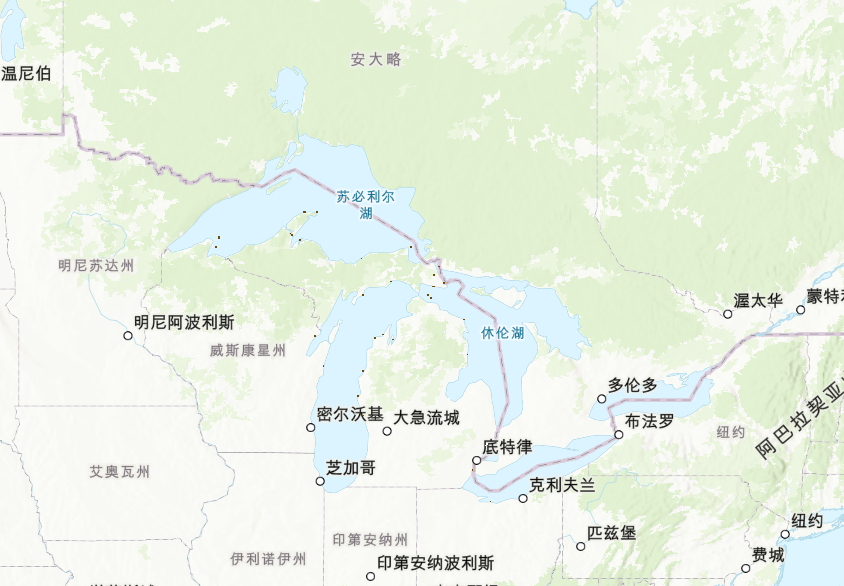
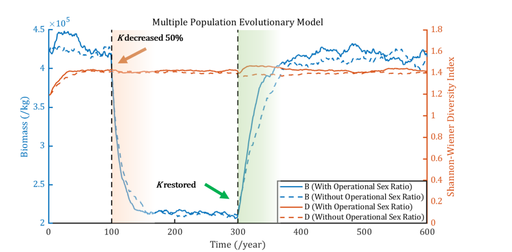
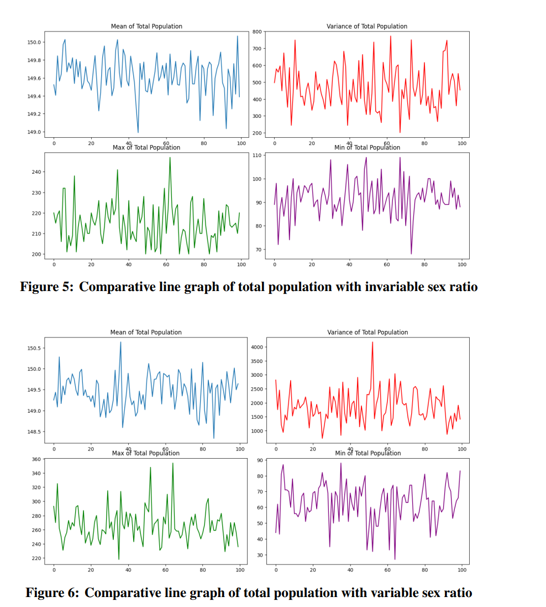

# Model  
1) divide lamprey into two groups:**larval** and **adult**  
- essence of logistic and lotka-Volterra model:  
devide the ecosystem into **different groups**  
    **NOTE:** aren't necessarily equivalent to species, can also be:  
    [1] predators and prey  
    [2] female and male  
2) **comparative experiment** to show **significance and difference**  
(e.g.  
Q: What's the **advantage and disadvantage** of alterable sex ratios?  
A: Given the result **with and without** alterable sex ratio, we can conclude that $\ldots$ )  
3) **quantify** abstract **evaluation index**  
(e.g.1  
Q: What's the impact on the stability of the ecosystem given $\ldots$  
A1: use the self-defined formula  $$p=\frac{1}{mn} \sum^{n}_{i=1}\sum^{m}_{j=1}(p_i-p_{ij})^2$$ 
Q: What's the impact on the larger ecological system $\ldots$  
A: measure ecological system in 3 ways: 
- **Biomass** : sum up the biomass of all creatures  
- **Diversity** : Shannon index using the biomass of all species  
- **Stability**  :  see above  
)  
# Sensitivity Analysis  
- alter **irrelevant** variables/ prameters  
- **compare** the orginal data and the altered data
# How to get data  
- graph(Great Lake)

#  
# Visualization  
## SHOW **INFO**!!!!
  

